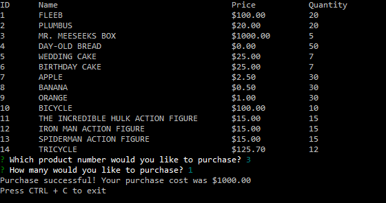
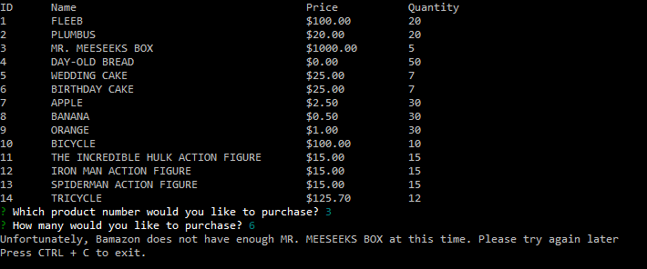
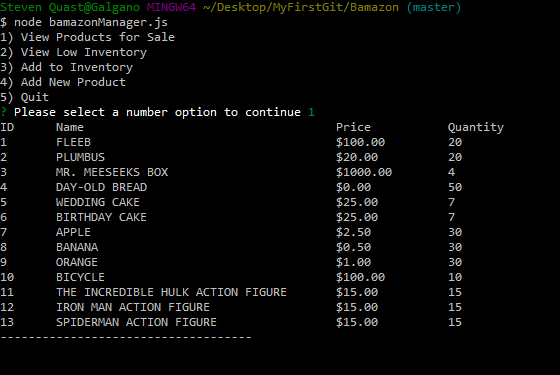
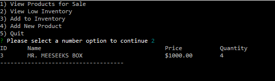
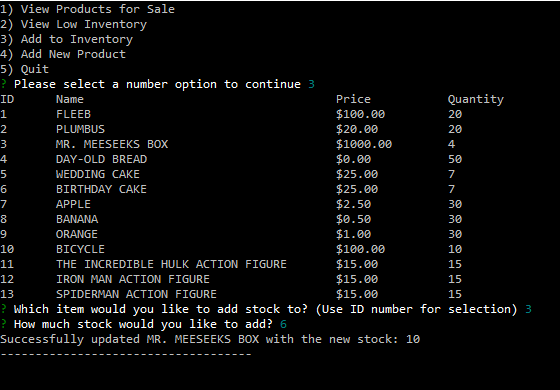
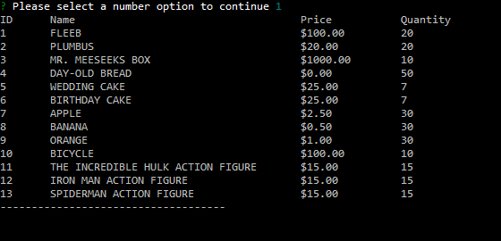
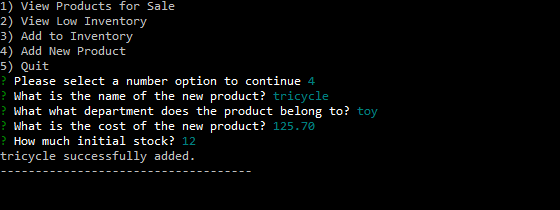
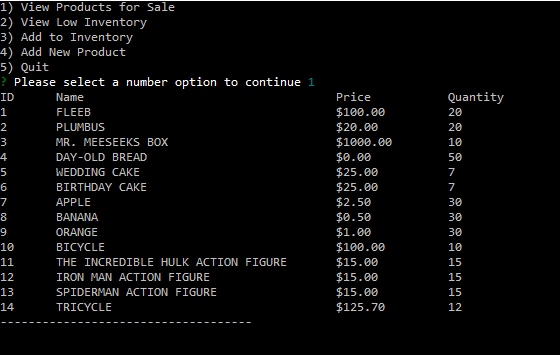

# Bamazon
There are two interfaces to Bamazon, a customer interface, and a manager interface. For a customer, you would run `bamazonCustomer.js`
and for a manager, you would run `bamazonManager.js`.

## Customer
As a customer, the user would be able to purchase items in stock.

But they will be unable to purchase more than the amount in stock

## Manager
As a manager, the user is able to:
#### **View Stock**

#### **View Products with Low Inventory**

#### **Add Stock to an Existing Product**

#### Add a New Product
###### Before:

###### During:

###### After:

#### **Exit the Interface**
Due to having multiple options, a Manager is given the ability to exit the interface

